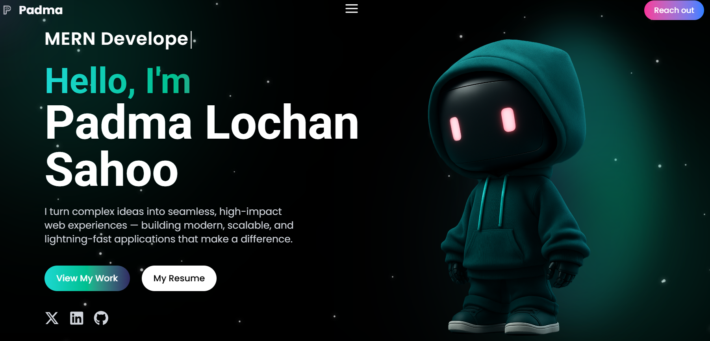

<div align="center">

# ✦ Padma Lochan Sahoo — Portfolio

### Full Stack Developer · MERN · DevOps · GenAI

[](https://padma-lochan-sahoo.vercel.app)
[](https://github.com/Padma-Lochan-Sahoo)
[](https://www.linkedin.com/in/padma-lochan-sahoo/)



</div>

---

## 📌 Overview

A production-grade personal portfolio built with **React 19 + Vite + Tailwind CSS v4 + Framer Motion** — showcasing projects, skills, work experience, and a live contact form powered by EmailJS.

Designed for performance, clean architecture, and scalability. Every section is animated, responsive across all screen sizes, and structured for long-term maintainability.

---

## 🌐 Live Demo

> **[https://padma-lochan-sahoo.vercel.app](https://padma-lochan-sahoo.vercel.app)**

---

## ✨ Features

| Feature | Details |
|---|---|
| 🎬 Intro Animation | Multilingual greeting sequence before the app loads |
| ⌨️ Typewriter Effect | Cycling role titles with smooth type/delete animation |
| 🎨 Custom Cursor | Gradient glow blob following the mouse |
| 🧭 Smart Navbar | Auto-hides on scroll, reappears on movement, smooth scroll to sections |
| 💡 Particle Background | Canvas-based animated particle field |
| 🛠️ Skills Carousel | Two infinite-scroll rows — scroll-direction aware (reverses on up/down) |
| 🗂️ Projects Showcase | Sticky scroll with background color transitions per project |
| 🔗 Project Links | Both GitHub and Live Demo links per project |
| 📅 Experience Timeline | Scroll-animated horizontal (desktop) / vertical (mobile) timeline |
| 💬 Testimonials | Animated card grid |
| 📬 Contact Form | EmailJS integration with client-side validation and toast notifications |
| 📄 Resume Download | Direct PDF download from navbar and hero section |
| 📱 Fully Responsive | Mobile-first design, tested across all breakpoints |

---

## 🏗️ Project Architecture

```
src/
├── assets/
│   ├── images/              # All project images
│   ├── icons/               # Icon assets
│   └── index.js             # Centralized asset exports
│
├── components/
│   ├── common/              # Reusable UI primitives
│   │   ├── CustomCursor.jsx
│   │   ├── GlowBlob.jsx
│   │   ├── IntroAnimation.jsx
│   │   ├── ParticlesBackground.jsx
│   │   └── SocialIcon.jsx
│   │
│   ├── layout/              # App-level layout components
│   │   ├── Navbar.jsx
│   │   ├── OverlayMenu.jsx
│   │   └── Footer.jsx
│   │
│   └── sections/            # Page sections
│       ├── Hero.jsx
│       ├── About.jsx
│       ├── Skills.jsx
│       ├── Projects.jsx
│       ├── Experience.jsx
│       ├── ExperienceItem.jsx
│       ├── Testimonials.jsx
│       └── Contact.jsx
│
├── constants/
│   ├── navLinks.js          # NAV_LINKS, SOCIAL_LINKS
│   └── index.js
│
├── data/
│   ├── skills.js            # skillsRowOne, skillsRowTwo
│   ├── projects.js          # projects[]
│   ├── experience.js        # experiences[]
│   ├── testimonials.js      # testimonials[]
│   └── index.js             # Re-exports all data
│
├── hooks/
│   ├── useIsMobile.js       # Responsive breakpoint detection
│   └── useTypewriter.js     # Typewriter animation logic
│
├── utils/
│   └── helpers.js           # scrollToSection, isValidEmail
│
├── pages/
│   └── Home.jsx             # Page composition
│
├── App.jsx                  # Root component + intro gate
└── main.jsx                 # ReactDOM entry point
```

---

## 🛠️ Tech Stack

| Category | Technology |
|---|---|
| **Framework** | React 19 |
| **Build Tool** | Vite 8 |
| **Styling** | Tailwind CSS v4 |
| **Animations** | Framer Motion 12 |
| **Icons** | React Icons 5 |
| **Email** | EmailJS Browser |
| **Notifications** | React Hot Toast |
| **Routing** | React Router DOM 7 |
| **Linting** | ESLint 10 |
| **Deployment** | Vercel |

---

## 🚀 Getting Started

### Prerequisites

- Node.js `>= 18.x`
- npm `>= 9.x`

### 1. Clone the repository

```bash
git clone https://github.com/Padma-Lochan-Sahoo/portfolio-padma.git
cd portfolio-padma
```

### 2. Install dependencies

```bash
npm install
```

### 3. Set up environment variables

Create a `.env` file in the project root (see `.env.example`):

```env
VITE_SERVICE_ID=your_emailjs_service_id
VITE_TEMPLATE_ID=your_emailjs_template_id
VITE_PUBLIC_KEY=your_emailjs_public_key
```

> Get these values from [EmailJS Dashboard](https://dashboard.emailjs.com/) → Email Services + Email Templates.

### 4. Run the development server

```bash
npm run dev
```

Open [http://localhost:5173](http://localhost:5173) in your browser.

---

## 📦 Build for Production

```bash
npm run build
```

Output is generated in the `dist/` folder.

To preview the production build locally:

```bash
npm run preview
```

---

## ☁️ Deploying to Vercel

### Option A — Via Vercel Dashboard (Recommended)

1. Push your code to GitHub
2. Go to [vercel.com](https://vercel.com) → **Add New Project**
3. Import your GitHub repository
4. Vercel auto-detects Vite — no configuration needed (`vercel.json` is included)
5. Add environment variables under **Settings → Environment Variables**:
   - `VITE_SERVICE_ID`
   - `VITE_TEMPLATE_ID`
   - `VITE_PUBLIC_KEY`
6. Click **Deploy** ✅

### Option B — Via Vercel CLI

```bash
npm install -g vercel
vercel --prod
```

### ⚠️ Important — Never commit `node_modules`

The `.gitignore` already excludes `node_modules/`. If you accidentally committed it before, clean it up:

```bash
git rm -r --cached node_modules
git commit -m "chore: remove node_modules from tracking"
git push
```

This prevents the `Permission denied` error on Vercel (`vite` binary loses `+x` when node_modules is committed on Windows).

---

## ⚙️ Environment Variables Reference

| Variable | Description | Where to Get |
|---|---|---|
| `VITE_SERVICE_ID` | EmailJS service ID | EmailJS → Email Services |
| `VITE_TEMPLATE_ID` | EmailJS template ID | EmailJS → Email Templates |
| `VITE_PUBLIC_KEY` | EmailJS public key | EmailJS → Account → API Keys |

---

## 📁 Key Files

| File | Purpose |
|---|---|
| `src/data/skills.js` | Add/remove skills for the carousel rows |
| `src/data/projects.js` | Add/edit projects (title, links, images) |
| `src/data/experience.js` | Update work experience entries |
| `src/constants/navLinks.js` | Update nav items and social links |
| `vercel.json` | Vercel deployment configuration |
| `.env.example` | Template for required environment variables |

---

## 🎨 Customization Guide

### Add a new project

Edit `src/data/projects.js`:

```js
{
  title: "My New Project",
  link: "https://live-demo-url.com",
  github: "https://github.com/your-username/repo",
  bgColor: "#1a1a2e",
  desktopImageKey: "MyDesktopImg",
  mobileImageKey: "MyMobileImg",
}
```

Then add the image to `src/assets/images/` and export it from `src/assets/index.js`.

### Add a new skill

Edit `src/data/skills.js` — add to `skillsRowOne` or `skillsRowTwo`:

```js
{ icon: SiYourTech, name: "Your Tech" }
```

### Update personal info

- **Name / bio / stats** → `src/components/sections/About.jsx`
- **Hero tagline / roles** → `src/components/sections/Hero.jsx`
- **Social links** → `src/constants/navLinks.js`

---

## 📜 Scripts

| Command | Description |
|---|---|
| `npm run dev` | Start development server |
| `npm run build` | Build for production |
| `npm run preview` | Preview production build locally |
| `npm run lint` | Run ESLint |

---

## 📄 License

This project is open source and available under the [MIT License](LICENSE).

---

## 🤝 Contact

**Padma Lochan Sahoo**

[](mailto:padmalochansahoo8503@gmail.com)
[](https://www.linkedin.com/in/padma-lochan-sahoo/)
[](https://github.com/Padma-Lochan-Sahoo)
[](https://x.com/Padma7848878503)

---

<div align="center">

Made with ❤️ by **Padma Lochan Sahoo**

⭐ Star this repo if you found it helpful!

</div>
